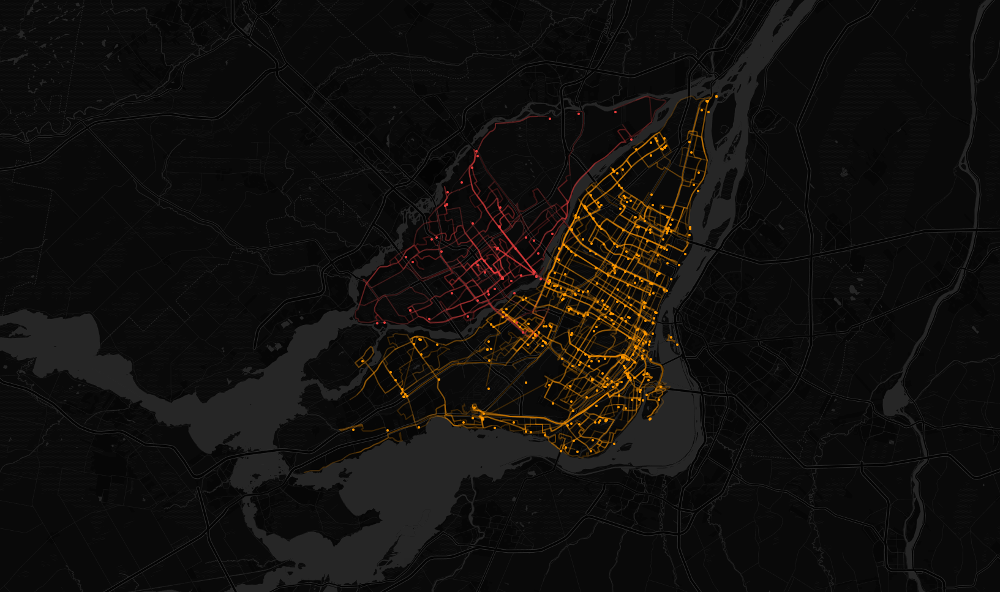

# Live public transit visualization

> Stream real-time bus data from the Montreal area to your browser

## Screenshot

## Installation

Prerequisite: [NodeJS](https://nodejs.org/en/) >= 10.0.0

 1. Run `npm install`.
 2. Run `npm run compile`.
 3. Run `npm run serve`.
 4. Navigate to [http://localhost:3002](http://localhost:3002).
